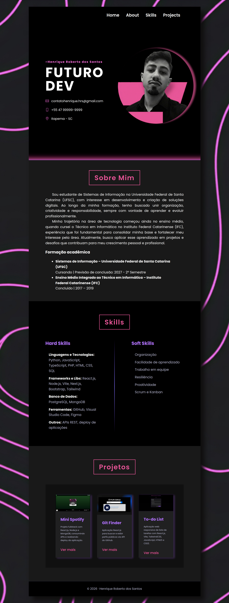

# Currículo Landing Page

Bem-vindo à minha **landing page de currículo**, desenvolvida com foco em front-end e responsivo. Este projeto serve como uma das tarefas Acelera ZG 2026/1.

---

## 🔹 Tecnologias Utilizadas

- **HTML5** e **CSS3**
- **Flexbox** e **Grid** para layout
- **Responsividade** com media queries
- **Fontes do Google Fonts** (Poppins)
- **SVG Icons** para contato
- Gradientes e efeitos de neon personalizados

---

## 🔹 Estrutura do Projeto

- **Home:** Apresenta meu nome, título profissional e contatos.
- **About:** Seção sobre mim, formação acadêmica e trajetória.
- **Skills:** Hard e soft skills organizadas em colunas.
- **Projects:** Portfólio com cards de projetos desenvolvid

